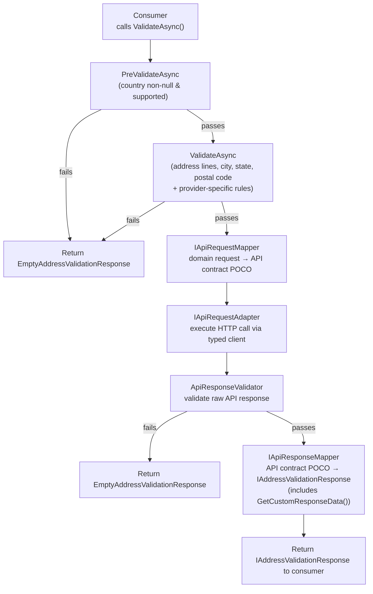

# Architecture

This document describes the internal architecture of the `Visus.AddressValidation` library suite. It is intended for contributors and maintainers who need to understand how the codebase is structured, how the runtime pipeline works, and what contracts must be satisfied when adding a new provider integration.

---

## Solution Layout

```
AddressValidation/
├── src/
│   ├── Visus.AddressValidation/                         Core abstractions, base classes, shared HTTP infrastructure
│   ├── Visus.AddressValidation.Integration.FedEx/       FedEx provider integration
│   ├── Visus.AddressValidation.Integration.Google/      Google Address Validation provider integration
│   ├── Visus.AddressValidation.Integration.PitneyBowes/ Pitney Bowes provider integration
│   ├── Visus.AddressValidation.Integration.Ups/         UPS provider integration
│   └── Visus.AddressValidation.SourceGeneration/        Roslyn incremental source generator
└── tests/
    ├── Visus.AddressValidation.Tests/
    ├── Visus.AddressValidation.Integration.FedEx.Tests/
    ├── Visus.AddressValidation.Integration.Google.Tests/
    ├── Visus.AddressValidation.Integration.PitneyBowes.Tests/
    ├── Visus.AddressValidation.Integration.Ups.Tests/
    └── Visus.AddressValidation.SourceGeneration.Tests/
```

Each integration package is independently versioned and published to NuGet. Consumers install only the packages they need. All packages target `net10.0` and are built with `IsAotCompatible = true`. The source generator targets `netstandard2.0` as required by the Roslyn host.

---

## Core Abstractions

The `Visus.AddressValidation` package defines every interface and base class shared across providers. Integration packages depend on it; it never depends on them.

### Domain Model

| Type | Role |
|---|---|
| `AbstractAddressValidationRequest` | Base request class. Holds the five canonical address fields (`AddressLines`, `CityOrTown`, `Country`, `PostalCode`, `StateOrProvince`). Automatically normalizes US territories (GU, PR, VI → US), clears `StateOrProvince` for city-states, and nullifies `PostalCode` for countries where the concept does not apply. |
| `IAddressValidationResponse` | Unified response interface returned to all consumers regardless of provider. Exposes `AddressLines`, `CityOrTown`, `Country`, `PostalCode`, `StateOrProvince`, `IsResidential`, `Errors`, `Warnings`, `Suggestions`, and `CustomResponseData`. |
| `AbstractAddressValidationResponse` | Base concrete implementation of `IAddressValidationResponse`. Errors and warnings are backed by `FrozenSet`. Equality is implemented via `AddressValidationResponseEqualityComparer`. |
| `EmptyAddressValidationResponse` | A null-object response returned when request validation fails before any API call is made, or when the raw API response fails post-call validation. |
| `CountryCode` | ISO 3166-1 Alpha-2 enum (247 values, numeric codes matching the ISO standard). Serialized as a string via `JsonStringEnumConverter`. |
| `ClientEnvironment` | `DEVELOPMENT`, `PRODUCTION`, or `SANDBOX`. Controls which endpoint URI a provider client resolves to. |

### Service Interface

`IAddressValidationService<TRequest>` is the single public-facing interface for library consumers:

```
Task<IAddressValidationResponse?> ValidateAsync(TRequest request, CancellationToken cancellationToken)
```

Consumers depend only on this interface and `IAddressValidationResponse`; they never reference any provider-specific type.

### Base Service

`AbstractAddressValidationService<TRequest, TApiResponse>` is the template method base for all provider services. It owns the five-step pipeline (see [Validation Pipeline](#validation-pipeline) below) and coordinates the injected collaborators: `IValidator<TRequest>`, `IApiRequestAdapter<TRequest, TApiResponse>`, and `IApiResponseMapper<TApiResponse>`.

### Base Authentication Service

`AbstractAuthenticationService<TClient>` handles OAuth 2.0 client-credentials token acquisition and caching. Concrete subclasses implement only `GenerateCacheKey()`. See [Authentication & Token Caching](#authentication--token-caching).

### Validation Infrastructure

`AbstractValidator<T>` defines a two-phase template:

1. **`PreValidateAsync`** — fast early-abort check (e.g., null country, unsupported country).
2. **`ValidateAsync`** — full rule evaluation (address lines, city, state/province, postal code).

`AbstractAddressValidationRequestValidator<T>` extends this with the shared rules that apply to all providers. Provider-specific validators extend it further to add their own rules and supply their `SupportedCountries` frozen set and `ProviderName`.

### HTTP Infrastructure

| Type | Role |
|---|---|
| `BearerTokenDelegatingHandler` | `DelegatingHandler` that injects `Authorization: Bearer <token>` into every outbound request to the provider API. Throws `InvalidCredentialException` if the token is absent. |
| `AbstractBasicAuthenticationClient` | Abstract OAuth2 client that authenticates using HTTP Basic auth (used by UPS and Pitney Bowes). |
| `HttpClientBuilderExtensions` | Two resilience pipeline presets registered via `Microsoft.Extensions.Http.Resilience`. See [HTTP Resilience](#http-resilience). |

---

## Integration Package Structure

Every integration package follows an identical internal directory layout:

```
<Provider>/
├── Abstractions/      Provider-specific enumerations (alert types, address classifications, etc.)
├── Adapters/          IApiRequestAdapter implementation — bridges service to the typed HTTP client
├── Clients/           Typed HttpClients for authentication and address validation
├── Configuration/     ServiceOptions POCO + IValidateOptions validator
├── Constants.cs       Endpoint URIs, supported locales, supported country sets
├── Contracts/         Raw API request/response POCOs (serialization shapes)
├── Extensions/        ServiceCollectionExtensions — the public DI registration entry point
├── Mappers/           Request mapper (domain → API) and response mapper (API → domain)
├── Models/            Concrete request and response types exposed to consumers
├── Resources/         Localizable .resx files for validation error messages
├── Serialization/     JsonSerializerContext for AOT-safe JSON serialization
├── Services/          Concrete AddressValidationService and AuthenticationService
└── Validation/        Request validator and API response validator
```

### Architectural Pattern: Template Method + Adapters/Mappers

The design combines the **Template Method** and **Port/Adapter** patterns:

- **Template Method**: All pipeline orchestration lives in the abstract base classes. A new provider implementation inherits and fills in the abstract members; it never re-implements the pipeline logic.
- **Port/Adapter**: Each pipeline step is expressed as a narrow interface (`IApiRequestAdapter`, `IApiRequestMapper`, `IApiResponseMapper`, `IValidator<T>`). Implementations are independently testable and replaceable. The service itself only depends on these interfaces, never on concrete HTTP or serialization details.

This combination means that adding a new provider requires writing the concrete types for each slot, but the orchestration, caching, resilience, and validation plumbing is inherited for free.

---

## Validation Pipeline

The following diagram shows the full request/response flow through `AbstractAddressValidationService`:



Steps 1–2 run entirely in-process. Steps 3–5 involve the network. Any unhandled exception from the HTTP client propagates to the caller; the resilience pipeline (see below) handles transient failures transparently before the exception surfaces.

---

## Authentication & Token Caching

All providers use the OAuth 2.0 client-credentials grant. The flow is:

1. Before the first address validation request, `BearerTokenDelegatingHandler` calls `AbstractAuthenticationService.GetTokenAsync()`.
2. `GetTokenAsync` checks `HybridCache` for a live token under the provider-specific cache key.
3. On a cache miss, the factory lambda calls the typed `IAuthenticationClient`, obtains a `TokenResponse`, and stores the token with a TTL of `ExpiresIn − 60` seconds (60-second safety buffer to avoid using an about-to-expire token).
4. `HybridCache` provides built-in stampede protection: concurrent cache misses for the same key execute the factory only once.

Cache keys are validated at construction time. They must consist solely of alphanumeric characters, underscores, hyphens, and colons, and are prefixed with `vs-ave-auth:`. An invalid key throws `InvalidImplementationException` at startup rather than silently failing at runtime.

The resilience pipeline for authentication clients is intentionally conservative: retries are disabled for `POST` requests (non-idempotent), and the circuit-breaker threshold is lower than for validation clients.

---

## HTTP Resilience

Two resilience pipelines are registered via `Microsoft.Extensions.Http.Resilience` (Polly v8):

### Authentication Clients (`AddAuthenticationClientResilienceHandler`)

- Retries disabled for unsafe HTTP methods (`POST`) to avoid duplicate token requests.
- Reduced circuit-breaker failure threshold — fail fast to surface credential problems quickly.

### Address Validation Clients (`AddAddressValidationClientResilienceHandler`)

- Full standard resilience pipeline (timeout, retry with exponential back-off, circuit breaker, bulkhead).
- Smart `Retry-After` parsing for HTTP 429 responses: prefers `delta-seconds` format, falls back to absolute date, defaults to 10 seconds if the header is absent or unparseable.

Both pipelines are registered once inside each provider's `ServiceCollectionExtensions.Add<Provider>AddressValidation()` extension method and are invisible to the consumer.

---

## AOT / Trim Compatibility

The library is designed to work in Native AOT and trimmed deployments:

- `IsAotCompatible = true` is set in `Directory.Build.props` and propagates to all non-test projects.
- All JSON serialization uses **source-generated `JsonSerializerContext`** (one per project, registered with `[JsonSerializable]` attributes). No `JsonSerializer` overloads that accept `Type` at runtime are used.
- `TokenResponse` uses a custom `JsonConverter<TokenResponse>` to handle polymorphic OAuth response shapes without reflection.
- `CustomResponseData` population on response objects is performed by source-generated code (see [Roslyn Source Generator](#roslyn-source-generator)) rather than by runtime reflection over properties.
- `FrozenSet` is used for all read-only, lookup-heavy collections (supported countries, city-states, no-postal-code countries) to maximize lookup performance after startup.

---

## Roslyn Source Generator

The `Visus.AddressValidation.SourceGeneration` package contains a single `IIncrementalGenerator` (`CustomResponseDataGenerator`) that targets `netstandard2.0`.

### Purpose

Provider API response contract types (the POCOs in each `Contracts/` directory) expose fields that are not part of the normalized `IAddressValidationResponse` but that consumers may still want to inspect. Rather than forcing consumers to cast to a provider-specific type, these fields are surfaced through `IAddressValidationResponse.CustomResponseData` as `IReadOnlyDictionary<string, object?>`.

Populating that dictionary via runtime reflection would break AOT. The source generator eliminates reflection by generating the population code at compile time.

### How It Works

1. Annotate any property on a response contract POCO with `[CustomResponseDataProperty]`. An optional argument overrides the default camelCase dictionary key.
2. At compile time, `CustomResponseDataGenerator` discovers all types with such annotations via an incremental syntax transform.
3. For each discovered type it emits a `partial class` (or `partial record`) in the same namespace, containing a `GetCustomResponseData()` method that returns `IReadOnlyDictionary<string, object?>` populated directly from the annotated properties — no reflection, no runtime scanning.
4. `AddressValidationResponseMapper` calls `GetCustomResponseData()` when constructing the final `IAddressValidationResponse`.

The generator handles nested types, sealed types, and records, and uses `ContainingTypeInfo` / `PropertyInfo` value types to keep the incremental pipeline cache-friendly.

---

## DI Registration

### Prerequisite

All provider integrations depend on `Microsoft.Extensions.Caching.Hybrid.HybridCache`. Register it before any provider:

```
services.AddHybridCache();
```

### Provider Registration

Each integration package exposes a single extension method on `IServiceCollection`:

| Package | Extension Method | Configuration Section |
|---|---|---|
| FedEx | `AddFedExAddressValidation()` | `AddressValidationSettings:FedEx` |
| Google | `AddGoogleAddressValidation()` | `AddressValidationSettings:Google` |
| Pitney Bowes | `AddPitneyBowesAddressValidation()` | `AddressValidationSettings:PitneyBowes` |
| UPS | `AddUpsAddressValidation()` | `AddressValidationSettings:Ups` |

Each extension method registers: `IOptions<TServiceOptions>` (with `.ValidateOnStart()`), `IValidateOptions<TServiceOptions>`, `IAddressValidationService<TRequest>`, `IAuthenticationService`, `IApiRequestMapper`, `IApiResponseMapper`, `IValidator<TRequest>`, `IApiRequestAdapter`, and the two typed `HttpClient` registrations (authentication + validation) with their respective resilience handlers.

Multiple providers can be registered simultaneously in the same `IServiceCollection`; they do not conflict because all registrations are keyed on provider-specific generic type parameters.

### Options Validation

Provider options classes extend `AbstractServiceOptions` and implement `IValidatableObject`. The cross-provider invariant enforced by `AbstractServiceOptions` is that `ClientEnvironment.SANDBOX` requires an explicit `EndpointUriOverride`. Provider options extend this with their own rules (e.g., FedEx validates the BCP-47 locale tag against its supported set; all providers enforce that credentials are non-empty strings).

---

## Testing Strategy

### Unit Tests (`Visus.AddressValidation.Tests`)

- Base class behavior is covered in isolation using **NSubstitute** mocks and a real `HybridCache` instance from a minimal `ServiceProvider`.
- Key scenarios: cache hit, cache miss, null/empty/whitespace token, concurrent requests with stampede protection (10 simultaneous calls, factory runs exactly once), invalid cache key format.

### Integration Tests (`Visus.AddressValidation.Integration.*.Tests`)

- Tests use **WireMock.Net** to run a local HTTP server that replays real JSON fixtures from each project's `Fixtures/` directory.
- The full `IServiceCollection` is assembled with the real `Add<Provider>AddressValidation()` extension method; only the `EndpointUriOverride` is pointed at the WireMock server.
- Scenarios covered per provider: happy path (fully resolved address), interpolated/ambiguous address (warnings), API error responses (4xx), empty/null/failed OAuth token, concurrent requests.

### Public API Contract Tests

Every project contains an `ApiTests.cs` that generates the full public API surface as text using **PublicApiGenerator** and asserts it matches a committed `.verified.txt` snapshot file via **Verify**. This prevents accidental breaking changes from merging silently.

### Source Generator Tests (`Visus.AddressValidation.SourceGeneration.Tests`)

- C# source strings are compiled in-memory using the Roslyn `CSharpGeneratorDriver`.
- Generated output is compared against committed `.verified.cs` snapshot files via **Verify.SourceGenerators**.
- Scenarios: root-level class, nested class.

### Test Framework

All test projects use **TUnit** with the **Microsoft Testing Platform** runner (configured in `global.json`). Assertions use **AwesomeAssertions**. Test data is provided by **AutoFixture** with AutoNSubstitute. Coverage is collected via `dotnet-coverage` and merged into a single report for SonarCloud.

---

## Cross-Cutting Concerns

### Central Package Management

All NuGet version pins live exclusively in `Directory.Packages.props`. Individual `.csproj` files never specify version numbers. This prevents version drift across the six source projects and six test projects. Renovate bot manages automated dependency update PRs.

### Localization

Validation error messages surfaced to library consumers are stored in `.resx` files inside each project's `Resources/` directory. Crowdin manages translations into six languages (de-DE, fr-FR, it-IT, es-ES, pt-BR, pt-PT). Only approved translations are exported. Crowdin opens signed PRs automatically; no manual translation workflow is required.

### Code Style and Analysis

- `.editorconfig` enforces C# style rules across all projects: no `var`, Allman-style braces, `s_` prefix for private static fields, `ConfigureAwait` required on all awaits (enforced as an error), explicit accessibility modifiers.
- `Directory.Build.props` enables `TreatWarningsAsErrors`, `EnforceCodeStyleInBuild`, and all analyzer categories via `AnalysisMode = AllEnabledByDefault`.
- **Meziantou.Analyzer** and **Roslynator.Analyzers** are injected into every project automatically via `Directory.Packages.props`.
- SonarCloud performs static analysis on every CI run.
